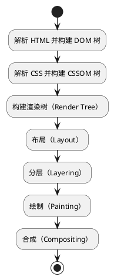

## 参考

- [渲染页面：浏览器的工作原理](https://developer.mozilla.org/zh-CN/docs/Web/Performance/Guides/How_browsers_work)
- [浏览器渲染原理【渡一教育】](https://www.bilibili.com/video/BV1Eh4y1c7CJ/)
- [图解「浏览器渲染原理」](https://juejin.cn/post/7262263050102095929)
